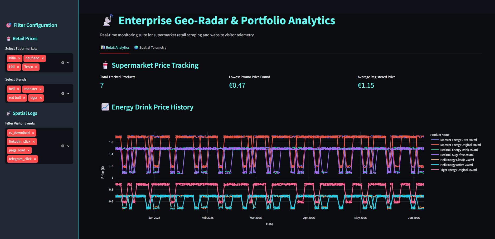
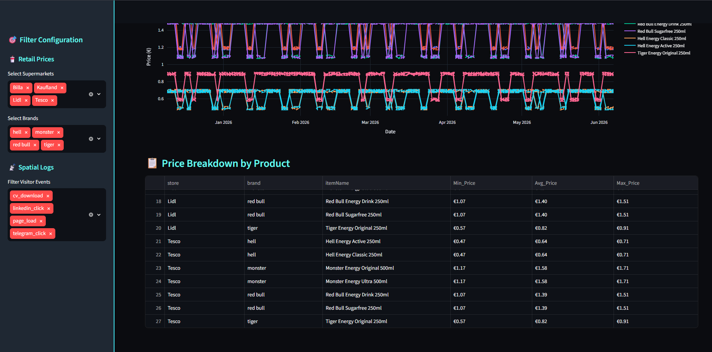
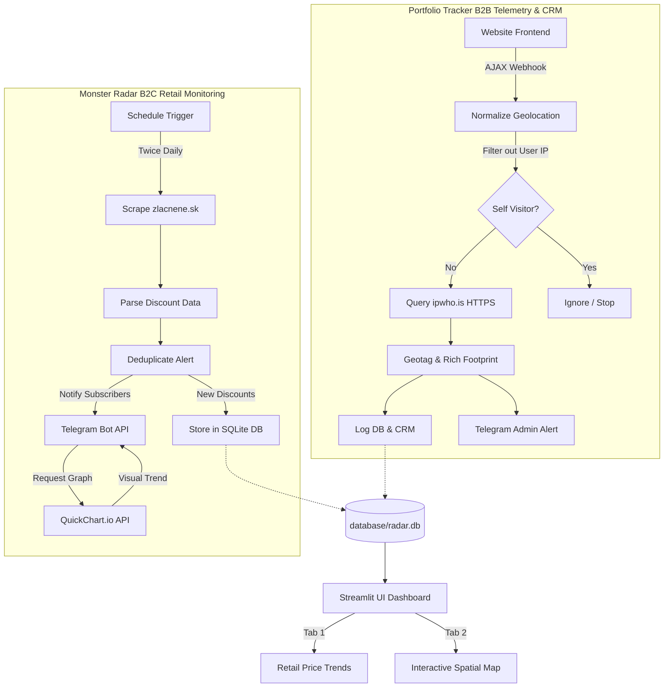

# 📡 Enterprise Geo-Radar & Portfolio Analytics

A production-ready spatial telemetry and retail pricing tracking suite. Built for high-performance scraping, anomaly detection, and B2B traffic analysis.

---

## 🖥️ User Interface Overview

Below are screenshots of the production-ready Streamlit Enterprise Dashboard visualizing both price metrics and spatial visitor tracking logs:

### 📊 Tab 1: Retail Price Analytics


### 🌍 Tab 2: Spatial Telemetry density and marker cluster map


---

## 🚀 Vision & Architecture

Enterprise Geo-Radar & Portfolio Analytics provides a modern, containerized stack designed to scrape retail websites, build historical pricing databases, track website telemetry, enrich visitor records with IP geolocations, and plot metrics on an interactive admin dashboard.



### 🛠️ Tech Stack

1. **Orchestration & Integration (n8n)**
   - Deployed inside a Docker container, managing cron triggers and API webhooks.
   - Handles the entire B2C Retail scraper pipeline and deduplicates discounts.
   - Captures anonymous frontend portfolio events (clicks, loads) and enriches them via the `ipwho.is` API.
   - Integrates with the Telegram Bot API (using Telegram Stars for premium checkouts) and syncs contacts with a Google Sheets CRM.

2. **Mock Data Engine & Analytics Persistence (Python & SQLite)**
   - Utilizes `mock_generator.py` to pre-seed the project database with 180 days of prices (Tesco, Kaufland, Lidl, Billa) and visitor logs.
   - Saves historical data inside a local, transaction-safe SQLite database file (`database/radar.db`).

3. **Interactive UI Visualization (Streamlit & Folium)**
   - Streamlit dashboard (`dashboard/app.py`) runs in a separate Docker service.
   - Tab 1 displays dynamic pricing tables, averages, and multi-line Plotly express timeline charts.
   - Tab 2 embeds an interactive Folium map (`streamlit_folium`) with HeatMap density overlays and MarkerClusters showing exact visit metrics and ISP entities (Slovak Telekom, Slovanet, UPC, Orange) in styled HTML popups.

---

## 🛠️ One-Click Deploy (Quick Start)

Launch the entire stack (n8n + Streamlit Dashboard) with a single command:

```bash
docker compose up --build -d
```

### 📡 Access Ports
- **Streamlit Dashboard:** [http://localhost:8501](http://localhost:8501)
- **n8n Orchestrator:** [http://localhost:5678](http://localhost:5678)

---

## 📂 Project Structure

- `dashboard/`
  - `app.py`: Streamlit dashboard visualization.
  - `Dockerfile`: Multi-stage build for Python Streamlit service.
- `database/`
  - `radar.db`: SQLite database file.
- `assets/`
  - `dashboard_1.png`: Price analytics visual capture.
  - `dashboard_2.png`: Density map visual capture.
- `mock_generator.py`: Generates the mock datasets.
- `docker-compose.yml`: Multi-container orchestrator.
- `.gitignore`: Strict ignore configurations for secrets protection.
- `.env`: Environment variables.
